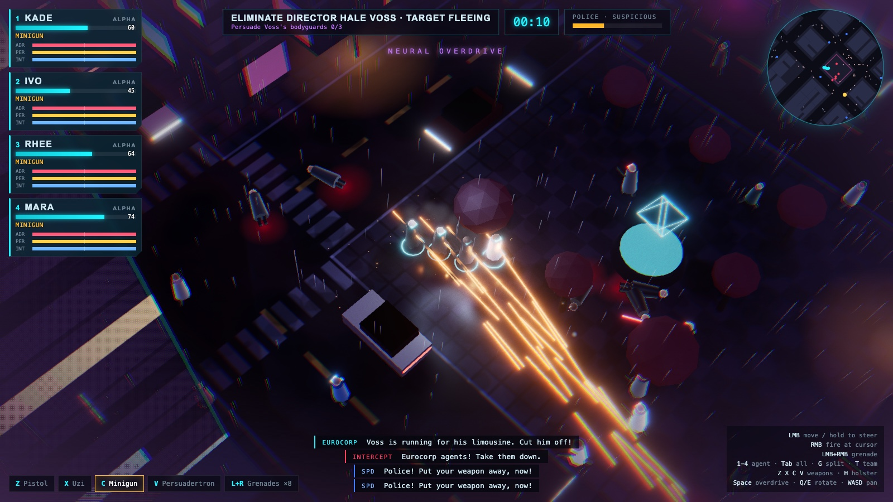
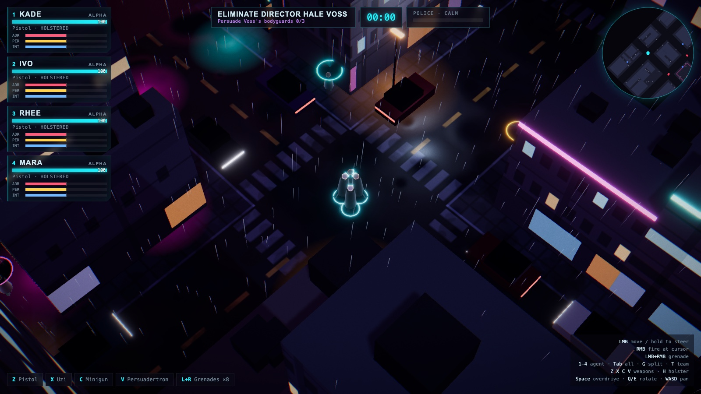
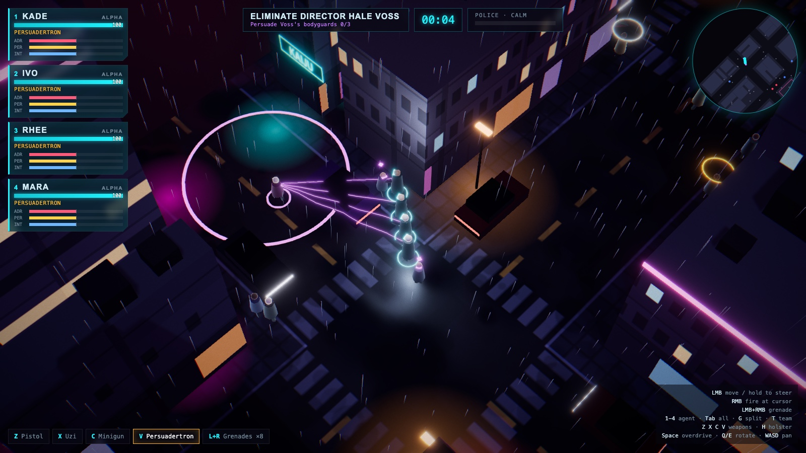
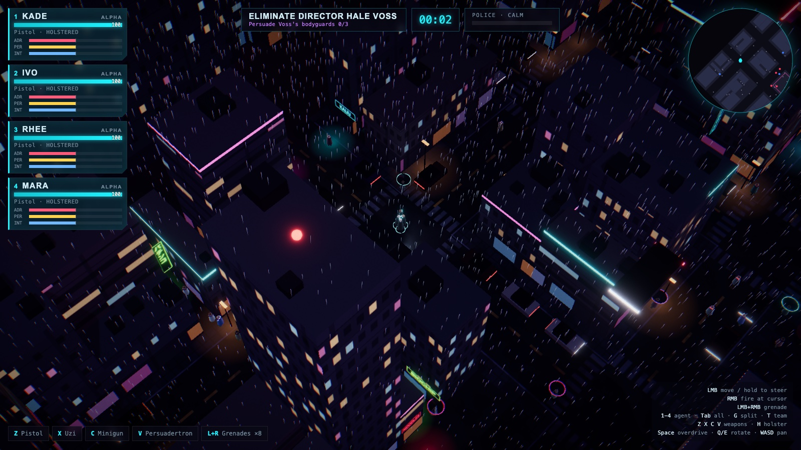
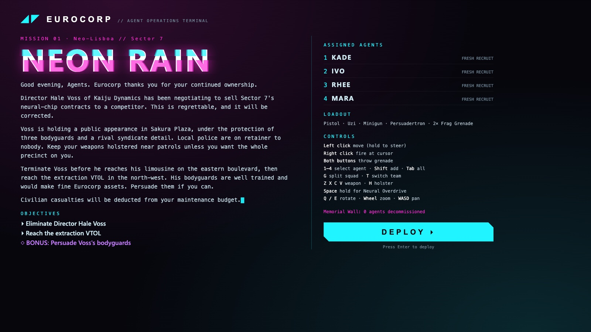
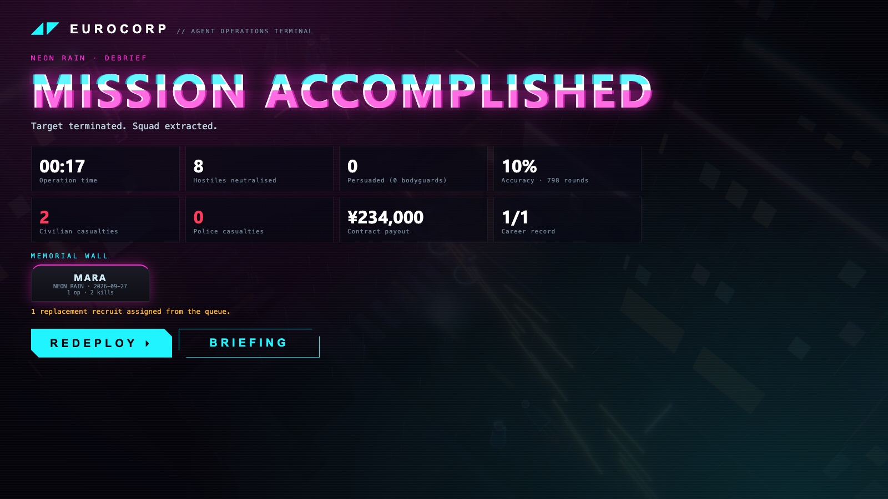
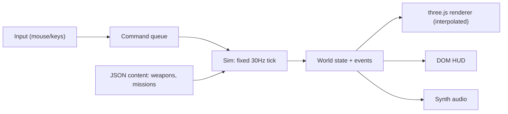

# Neon Rain

A modern reinterpretation of **Syndicate** (Bullfrog, 1993), rebuilt around the looser, more fluid controls of **Cannon Fodder** (Sensible Software, 1993). You command four Eurocorp cyborg agents through a rain-soaked, neon-lit city: assassinate, persuade, and extract.

This is a web vertical slice built with three.js and TypeScript. The simulation is deterministic and independent of the renderer, so online multiplayer and a later Godot or Unity port don't require a rewrite.



## Screenshots

| | |
| --- | --- |
|  |  |
|  |  |



## The idea

**Kept from Syndicate:** four trench-coated cyborgs working for an amoral megacorp, the Persuadertron, IPA drug levels (Adrenaline, Perception, Intelligence) on every agent, the minigun and Gauss gun, police who tell you to holster your weapon, a rival syndicate, and cold corporate satire in the briefings.

**Borrowed from Cannon Fodder:** left click moves, right click fires wherever the cursor is, and both buttons together throw a grenade. You can move and shoot at the same time. The squad trails its leader along a breadcrumb path instead of needing micromanagement, you can split it into two teams, and fallen agents go on a Memorial Wall while fresh recruits take their place.

**New:**
- **Neural Overdrive:** hold Space to slow time, at the cost of agent health.
- **Procedural city:** rain, bloom, and wet-street reflections.
- **Camera:** free orbit and tilt, from a low 3/4 angle to straight top-down. Buildings between the camera and your squad, cursor, or target turn into see-through outlines.
- **Traffic:** cars drive in lanes, stop at traffic lights, and yield to pedestrians on crosswalks. They can't stop instantly, though, so an agent who sprints out in front of one gets hit.
- **Police heat:** escalates in tiers, from patrols to enforcer squads.
- **Crowd panic:** fear spreads through the crowd.
- **Synthesized audio:** generated in code, with no asset files.

## The mission: Neon Rain

Director Hale Voss of Kaiju Dynamics is holding a public appearance in Sakura Plaza, guarded by three bodyguards and a rival syndicate detail. Kill him before he reaches his limousine on the eastern boulevard, then get your squad to the extraction VTOL. As a bonus, persuade his bodyguards to switch sides.

## Running it

You need Node.js 18 or newer and a desktop browser with WebGL2 (any current Chrome, Edge, Firefox, or Safari). A mouse with a right button is strongly recommended.

```bash
npm install
npm run dev
```

Then open http://localhost:5173.

| Command | What it does |
| --- | --- |
| `npm run dev` | Dev server with hot reload |
| `npm run build` | Typecheck and build a static site into `dist/` |
| `npm run preview` | Serve the production build locally |
| `npm run typecheck` | TypeScript only |
| `npm run sim:smoke` | Play the mission headless in Node and verify determinism |
| `npm run sim:traffic` | Check that cars stay on roads and calm pedestrians are never hit |

URL options: `?autostart` skips the briefing, and `?seed=123` changes the random seed for the population and events.

## Controls

| Input | Action |
| --- | --- |
| Left click / hold | Move the selected agents (hold to steer) |
| Right click / hold | Fire at the cursor |
| Left + right click | Throw a grenade |
| `1`–`4` | Select an agent (`Shift` adds or removes) |
| `Tab` | Select all agents |
| `G` | Split the selection into a second team (with everyone selected, merges back) |
| `T` | Switch between teams |
| `Z` `X` `C` `V` | Pistol, Uzi, Minigun, Persuadertron |
| `R` | Cycle weapon |
| `H` | Holster or draw |
| `Space` (hold) | Neural Overdrive |
| Middle drag / `Alt` + left drag | Orbit the camera freely (rotate and tilt) |
| `Q` / `E` (hold) | Rotate the camera |
| `Shift` + wheel, `PageUp` / `PageDown` | Tilt, from a low 3/4 angle to straight down |
| `Y` | Toggle top-down view |
| Mouse wheel | Zoom |
| `W` `A` `S` `D` / arrows | Pan the camera |
| `F` | Reset the view |
| `Esc` / `P` | Pause |
| `O` | Performance overlay (FPS, render scale) |

Drag the ADR, PER, and INT bars on each agent's card to set their IPA levels. Higher levels make agents faster, more perceptive, or more accurate, but push the levels too far and they drain health.

## How it's built



- **`src/sim/`** is pure TypeScript with no three.js or DOM imports. It runs in fixed 30Hz ticks with a seeded random number generator, and changes only in response to commands. Because of that, it runs headless in Node, which also makes it the basis for an authoritative multiplayer server later.
  - `map.ts`: procedural city layout (blocks, lots, alleys, plaza, parked cars).
  - `nav.ts`: A* pathfinding with path smoothing, line of sight, and flow fields for crowds. Pedestrians keep to sidewalks and cross at crosswalks.
  - `traffic.ts`: lane-following cars, traffic signals, intersection right-of-way, yielding and braking for pedestrians, and car impacts.
  - `systems/`: movement and follow-the-leader, combat and projectiles, AI, crowd, police heat, persuasion, IPA and overdrive, objectives.
- **`src/render/`** draws the world from the sim state and interpolates between ticks. Buildings, props, and characters are instanced. A custom facade shader draws windows, shopfronts, and roof trims. The post-processing pass does bloom, tone mapping, SMAA, chromatic aberration, and film grain, and adjusts render resolution to hold frame rate. That resolution scaling is the web stand-in for DLSS or FSR.
- **`src/ui/`** has the HUD, minimap, briefing, and debrief, plus the persistent roster and Memorial Wall (saved in `localStorage`).
- **`src/audio/`** synthesizes every sound effect and the ambient music loops in code, then plays them through Howler.
- **`src/content/`** holds the data-driven weapons, agent template, and mission definition. Most balance tuning lives here.

## Dev tooling

- `node scripts/sim-smoke.ts` runs the whole mission headless with a scripted squad, then checks that two runs with the same inputs produce identical state.
- `node scripts/traffic-check.ts` runs 3 minutes of city life with no player input. It fails if any car leaves the road, or if more than a couple of calm (non-panicked) pedestrians are hit.
- `node scripts/diag.ts [--drawn]` is a balance probe: it walks the squad toward the plaza and logs how the fight unfolds.
- `node scripts/shot.ts --url ... --wait ... --eval ... --shot delay:path.png` drives a headless Chromium over the DevTools protocol to capture screenshots and run scripted scenes. With the dev server running, `window.game.advance(ticks, commands)` fast-forwards the sim.

## Roadmap

- Tune feel and difficulty from playtesting.
- Syndicate's world map: territories, tax rates, and unrest.
- Research and cyborg modifications between missions.
- More missions and city districts.
- Online co-op, with the sim running on an authoritative Node server.
- Port to Godot or Unity for native rendering and DLSS/FSR. A Godot project scaffold is already in the repo root.

## Disclaimer

A non-commercial fan project. Not affiliated with or endorsed by Electronic Arts, Bullfrog Productions, or Sensible Software. Syndicate and Cannon Fodder are trademarks of their respective owners.
