# Neon Rain

A modern reinterpretation of **Syndicate** (Bullfrog, 1993), rebuilt around the looser, more fluid controls of **Cannon Fodder** (Sensible Software, 1993). You command four Eurocorp cyborg agents through a rain-soaked, neon-lit city: assassinate, persuade, and extract.

This is a web vertical slice built with three.js and TypeScript. The simulation is deterministic and independent of the renderer, so online multiplayer and a later Godot or Unity port don't require a rewrite.


## Screenshots

| | |
| --- | --- |
|  |  |
|  |  |


## The idea

**Kept from Syndicate:** four trench-coated cyborgs working for an amoral megacorp, the Persuadertron, IPA drug levels (Adrenaline, Perception, Intelligence) on every agent, the minigun and Gauss gun, police who tell you to holster your weapon, a rival syndicate, and cold corporate satire in the briefings.

**Borrowed from Cannon Fodder:** left click moves, right click fires wherever the cursor is, and both buttons together throw a grenade. You can move and shoot at the same time. The squad trails its leader along a breadcrumb path instead of needing micromanagement, you can split it into two teams, and fallen agents go on a Memorial Wall while fresh recruits take their place.

**New:**
- **Neural Overdrive:** hold Space to slow time, at the cost of agent health.
- **Procedural city:** rain, bloom, and wet-street reflections.
- **Camera:** free orbit and tilt, from a low 3/4 angle to straight top-down. Buildings between the camera and your squad, cursor, or target turn into see-through outlines.
- **Traffic:** cars drive in lanes, stop at traffic lights, and yield to pedestrians on crosswalks. They can't stop instantly, though, so an agent who sprints out in front of one gets hit.
- **Police heat:** escalates in tiers, from patrols to enforcer squads.
- **Crowd panic:** fear spreads through the crowd.
- **Synthesized audio:** generated in code, with no asset files.

## The mission: Neon Rain

Director Hale Voss of Kaiju Dynamics is holding a public appearance in Sakura Plaza, guarded by three bodyguards and a rival syndicate detail. Kill him before he reaches his limousine on the eastern boulevard, then get your squad to the extraction VTOL. As a bonus, persuade his bodyguards to switch sides.

## Running it

You need Node.js 18 or newer and a desktop browser with WebGL2 (any current Chrome, Edge, Firefox, or Safari). A mouse with a right button is strongly recommended.

```bash
npm install
npm run dev
```

Then open http://localhost:5173.

| Command | What it does |
| --- | --- |
| `npm run dev` | Dev server with hot reload |
| `npm run build` | Typecheck and build a static site into `dist/` |
| `npm run preview` | Serve the production build locally |
| `npm run typecheck` | TypeScript only |
| `npm run sim:smoke` | Play every mission headless in Node and verify determinism |
| `npm run sim:traffic` | Check that cars stay on roads and calm pedestrians are never hit |
| `npm run lab:e2e` | Drive the Lab's mission editor and importer in headless Chrome (needs `npm run dev`) |
| `npm run synd -- list` | List the original Syndicate missions found under `content-local/` |
| `npm run synd:convert -- --all` | Convert every original mission into a playable local mission |

URL options: `?autostart` skips the briefing, `?seed=123` changes the random seed for the population and events, and `?mission=synd_03` picks a mission. The briefing screen also has an operation picker listing every mission the game can see.

The Lab, a set of development tools that includes the mission editor, is at http://localhost:5173/lab.html (see [The Lab](#the-lab)).

## Controls

| Input | Action |
| --- | --- |
| Left click / hold | Move the selected agents (hold to steer) |
| Right click / hold | Fire at the cursor |
| Left + right click | Throw a grenade |
| `1`–`4` | Select an agent (`Shift` adds or removes) |
| `Tab` | Select all agents |
| `G` | Split the selection into a second team (with everyone selected, merges back) |
| `T` | Switch between teams |
| `Z` `X` `C` `V` | Pistol, Uzi, Minigun, Persuadertron |
| `R` | Cycle weapon |
| `H` | Holster or draw |
| `Space` (hold) | Neural Overdrive |
| Middle drag / `Alt` + left drag | Orbit the camera freely (rotate and tilt) |
| `Q` / `E` (hold) | Rotate the camera |
| `Shift` + wheel, `PageUp` / `PageDown` | Tilt, from a low 3/4 angle to straight down |
| `Y` | Toggle top-down view |
| Mouse wheel | Zoom |
| `W` `A` `S` `D` / arrows | Pan the camera |
| `F` | Reset the view |
| `Esc` / `P` | Pause |
| `O` | Performance overlay (FPS, render scale) |

Drag the ADR, PER, and INT bars on each agent's card to set their IPA levels. Higher levels make agents faster, more perceptive, or more accurate, but push the levels too far and they drain health.

## How it's built

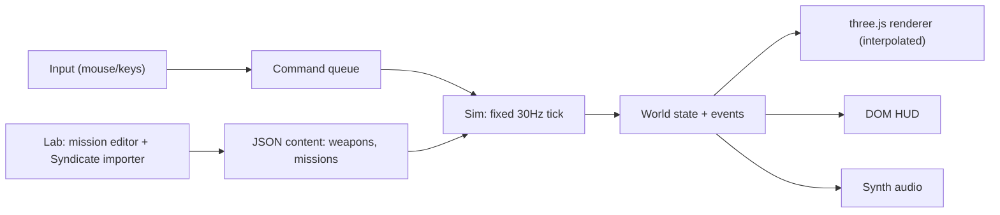

- **`src/sim/`** is pure TypeScript with no three.js or DOM imports. It runs in fixed 30Hz ticks with a seeded random number generator, and changes only in response to commands. Because of that, it runs headless in Node, which also makes it the basis for an authoritative multiplayer server later.
  - `map.ts`: procedural city layout (blocks, lots, alleys, plaza, parked cars).
  - `mapAuthored.ts`: builds the same `CityMap` from a fixed, hand-made or imported layout.
  - `nav.ts`: A* pathfinding with path smoothing, line of sight, and flow fields for crowds. Pedestrians keep to sidewalks and cross at crosswalks.
  - `traffic.ts`: lane-following cars, traffic signals, intersection right-of-way, yielding and braking for pedestrians, and car impacts.
  - `systems/`: movement and follow-the-leader, combat and projectiles, AI, crowd, police heat, persuasion, IPA and overdrive, objectives.
- **`src/render/`** draws the world from the sim state and interpolates between ticks. Buildings, props, and characters are instanced. A custom facade shader draws windows, shopfronts, and roof trims. The post-processing pass does bloom, tone mapping, SMAA, chromatic aberration, and film grain, and adjusts render resolution to hold frame rate. That resolution scaling is the web stand-in for DLSS or FSR.
- **`src/ui/`** has the HUD, minimap, briefing, and debrief, plus the persistent roster and Memorial Wall (saved in `localStorage`).
- **`src/audio/`** synthesizes every sound effect and the ambient music loops in code, then plays them through Howler.
- **`src/content/`** holds the data-driven weapons, agent template, and missions. Most balance tuning lives here.
- **`src/import/syndicate/`** reads the original Syndicate data files and converts missions into our format (see [Playing the original Syndicate missions](#playing-the-original-syndicate-missions)). It's plain TypeScript, so the same code runs in the Lab and in the CLI.
- **`src/lab/`** is the Lab: an app bar with lazily loaded tools that share one WebGL stage.

### Mission files

A mission is one JSON file (`src/sim/content.ts` has the full types). The map is either procedural (generator parameters and a seed) or an authored layout. Units are either placed by Neon Rain's rules, or listed explicitly as spawns. Objectives are a typed list checked in order: `eliminate`, `persuade`, `protect`, `extract`, `reach` and `sweep`.

```jsonc
{
  "id": "op_harbour",
  "codename": "SALT WIND",
  "map": { "kind": "authored", "layout": {
    "w": 180, "h": 140,
    "ground": "rle:…", "blocked": "rle:…",           // one byte per 1 m cell, run-length + base64
    "buildings": [{ "x": 20, "y": 12, "w": 18, "h": 10, "height": 14 }],
    "props": [{ "kind": "car", "x": 40, "y": 60, "w": 4, "h": 2 }],
    "spawn": { "x": 12, "y": 128 }, "extraction": { "x": 20, "y": 130 } } },
  "spawns": [
    { "id": "boss", "kind": "target", "x": 90, "y": 40, "name": "Harbourmaster Okon" },
    { "id": "g1", "kind": "guard", "x": 88, "y": 44, "patrol": [{ "x": 80, "y": 44 }, { "x": 96, "y": 44 }] }
  ],
  "objectives": [
    { "id": "kill", "type": "eliminate", "targets": ["boss"], "text": "Eliminate the harbourmaster" },
    { "id": "out", "type": "extract", "text": "Reach the extraction VTOL" }
  ]
}
```

Missions in `src/content/missions/` ship with the game. Missions in `content-local/missions/` are gitignored and visible only to the dev server; that's where Lab drafts and converted Syndicate missions live. Older files (Neon Rain as first written, with untyped `kill` and `extract` objectives) are upgraded on load, and Neon Rain plays exactly as before: `sim:smoke` checks its determinism hash.

## The Lab

`/lab.html` (run `npm run dev`, then open http://localhost:5173/lab.html) is a set of development tools behind one app bar. Switch between them with the tabs or `⌘1` to `⌘3`. The active tool is part of the URL (`?tool=missions`), so every view is a deep link. Tools load on first use, and they share one WebGL stage, which the active tool borrows.

| Tool | What it's for |
| --- | --- |
| **Art** | Style boards for settling the art direction: characters, environment, props, animation, style comparisons and imported models |
| **Missions** | Mission library and editor: map, units, objectives and briefing, with validation, a 3D preview and one-click playtesting |
| **Import** | Loads the original Syndicate data files, previews the conversion side by side, and turns missions into drafts for the editor |

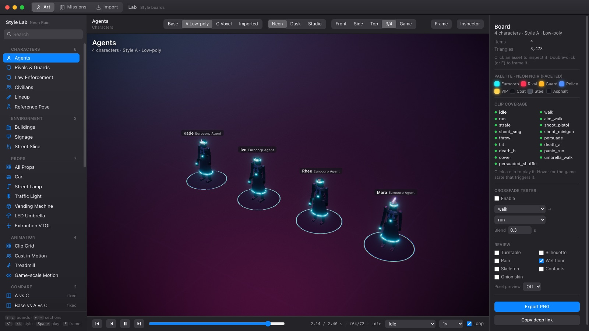

### Missions: library and editor

The library lists every mission the dev server can see, with a thumbnail of its map. Missions that ship with the game are shown apart from local ones. From each card you can open, play, duplicate or delete a mission. **Promote** moves a local mission into `src/content/missions/` so it gets committed; only do that for missions that are your own design. **New mission…** starts from a procedural city or a blank map.

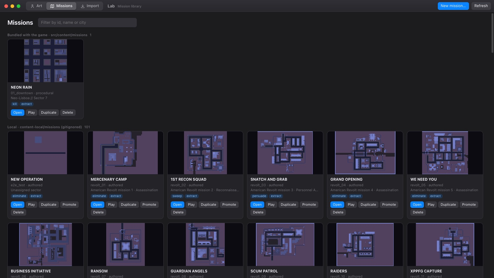

The editor has tools on the left, the map in the middle and panels on the right:

- **Map:**
  - Paint ground (road, sidewalk, plaza, alley) and obstacles with a brush, or fill a rectangle with `Shift`-drag.
  - Drag out buildings, then set their height, or resize them by the corner handle.
  - Place props (cars, trees, lamps, benches, planters, vending machines).
  - Move the squad spawn, extraction VTOL and escape point.
  - A procedural city is read-only until you **bake** it into a layout. Baking freezes it as it is, but loses the traffic, which needs grid roads.
- **Units:** place civilians, police, enforcers, rivals, heavies, guards and targets. Give armed units a patrol route, or tell them to hold their post. The inspector sets name, HP, armour and weapons. **Bake procedural units** runs Neon Rain's placement once and turns it into editable spawns.
- **Objectives:** add, reorder and retype objectives. Pick their targets or points straight off the map.
- **Mission and briefing:** codename, city, seed, time of day, police thresholds, extra population, procedural city parameters and the briefing text.
- **Validation** builds the real navigation grid and checks the draft:
  - the extraction and each target can be reached from the squad spawn;
  - no unit starts inside an obstacle;
  - objectives point at units that exist;
  - weapon names are known;
  - the map fits the size budget.

  Click an issue to jump to it.
- **3D preview** (`T`) renders the draft with the game's own city renderer. **Playtest** saves the mission and opens it in the game in a new tab.

Undo and redo cover every edit. Layers (ground, buildings, props, units, routes, markers, validation, grid, and the original Syndicate tiles for imported maps) can be toggled on and off.

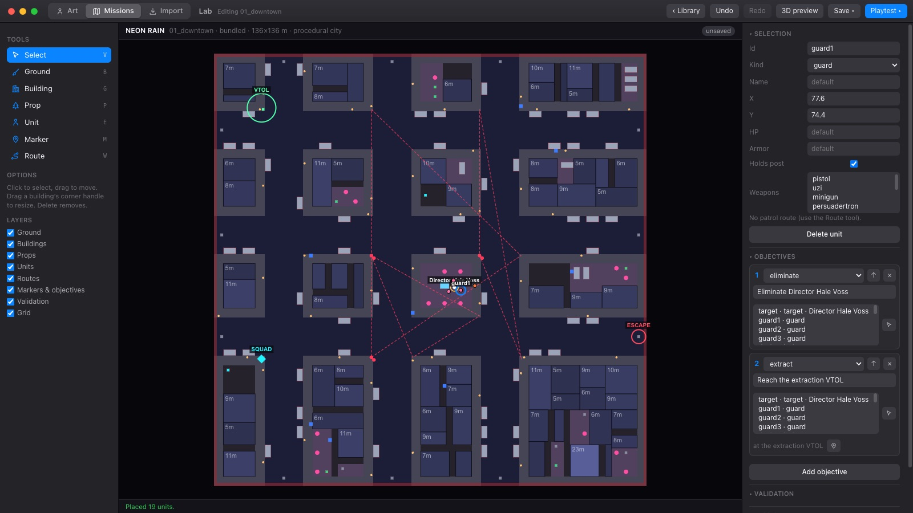

| Key | Action |
| --- | --- |
| `V` `B` `G` `P` `E` `M` `W` | Select, Ground, Building, Prop, Unit, Marker, Route |
| Drag / `Delete` | Move / remove the selection |
| Wheel, right or middle drag, `Space` + drag | Zoom and pan; double-click or `F` fits the map |
| `T` | Toggle the 3D preview |
| `⌘Z` / `⇧⌘Z` / `⌘S` | Undo, redo, save |
| `Esc` / `Enter` | Finish a route, cancel a pick, deselect |

**Saving and playtesting:**

- **Where Save writes:** back to where the mission came from. Bundled missions go to `src/content/missions/`, pretty-printed so they review well in git. Local ones go to `content-local/missions/`.
- **Save as:** change the id in the *Mission* panel, then save.
- **Playtest:** saves, then opens `/?mission=<id>&autostart` in a new tab.
- **No reloads:** saving doesn't reload pages that are already open, so the editor keeps its state and undo history. The game picks up the new version the next time it loads.
- **Without the dev server:** in the static build, Save downloads the JSON instead.

#### Original missions in the editor

Converted Syndicate missions open in the editor like any other mission. Below are four of the original campaign's missions after conversion, with nothing edited by hand. They show what the converter keeps and where you'd step in.

**Mission 1, Mercenary camp (assassination).** The colonel (`p8`, ringed in gold) is selected in the inspector. He's in the northern hut, as the briefing says. The camp's perimeter walls and huts are buildings, and the guards' patrol routes are the pink dashed lines. The objective list shows the converted chain: *eliminate p8*, then *reach the extraction VTOL*, which sits a few metres from the squad's drop point on the east side.

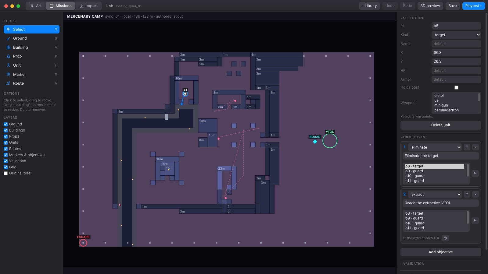

**Mission 12, Waterworks (persuade, assassinate, evacuate).** This is the longest objective chain in the early campaign, converted into three ordered objectives:

1. Persuade `p17`.
2. Eliminate `p16`, selected here in the top-left compound.
3. Escort `p17` to the evacuation point, the green ring by the squad.

The city stands on a raised deck (street level 3), and the converter found it automatically. The 3D preview shows the same mission through the game's renderer.

| | |
| --- | --- |
| 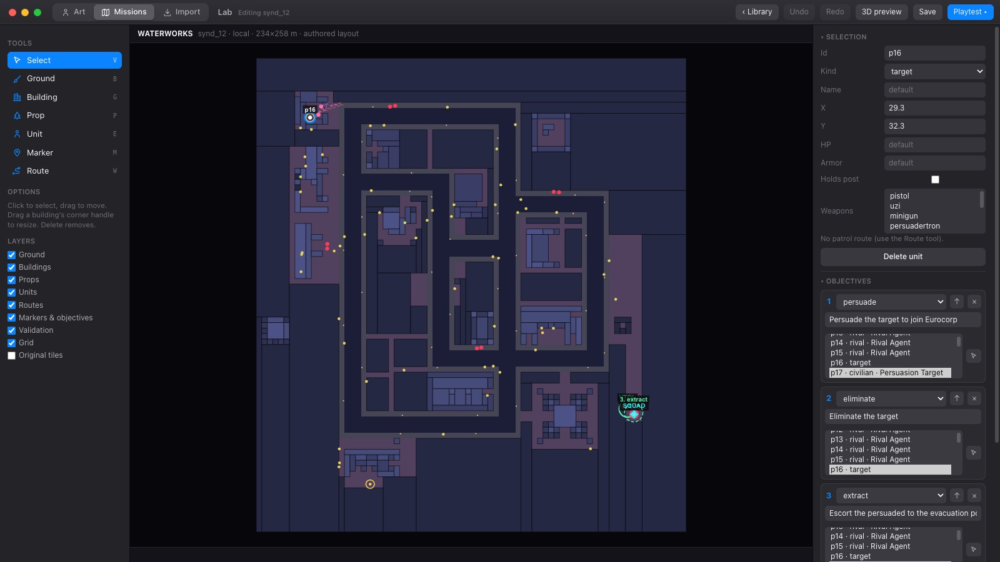 | 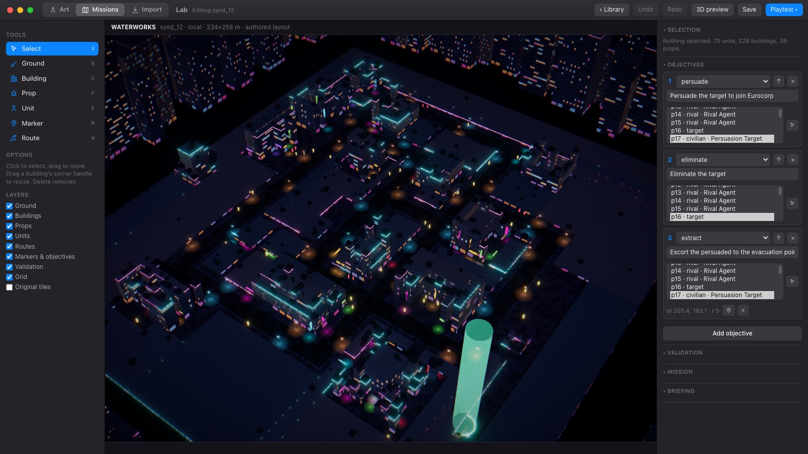 |

**Mission 25, Stir crazy (protect).** The VIP (`p38`) walks their original route from the compound at the top, which is full of criminals and guards, to a pick-up in the south-west corner. The blue dashed line runs from the selected VIP to the objective ring labelled *1. protect*. The objective completes when the VIP gets there, and fails if they die on the way. The orange rings are validation warnings: units the original placed on spots that are now inside obstacles, which the game will move to the nearest free cell.

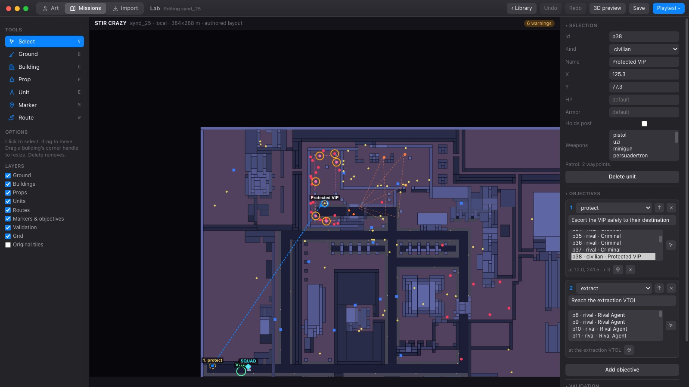

**Mission 6, Business initiative, with the *Original tiles* layer.** The layer lays the converter's tile-by-tile reading of the original over the result: green where it found building, purple where it found covered ground. It makes it quick to see where a hand fix is worth it. Here the target (`p163`) waits in the bottom-left compound of an elevated road network.

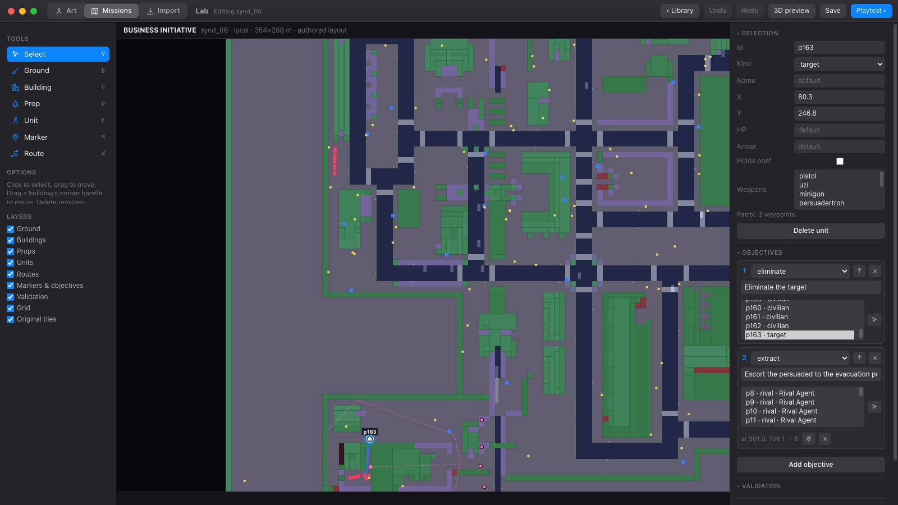

A typical pass over an imported mission:

1. Turn on *Original tiles* and compare the result with the original; the Import tool shows the original next to it.
2. Fix the map where the flattening lost something. Paint obstacles back in, clear a doorway, or move a building edge with the corner handle.
3. Work through the validation list. Units stuck in obstacles get moved, and anything a target needs to reach gets opened up.
4. Replace any objective marked with a TODO (vehicle objectives come in as *reach a point*), and give the key units names and weapons.
5. Rewrite the briefing in Neon Rain's voice, then **Playtest**.

A converted mission stays in the gitignored `content-local/`. **Promote** it only once it has become your own design.

| | |
| --- | --- |
| 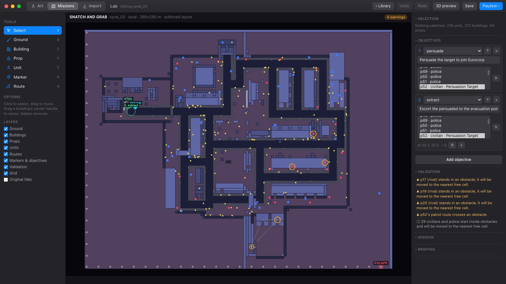 | 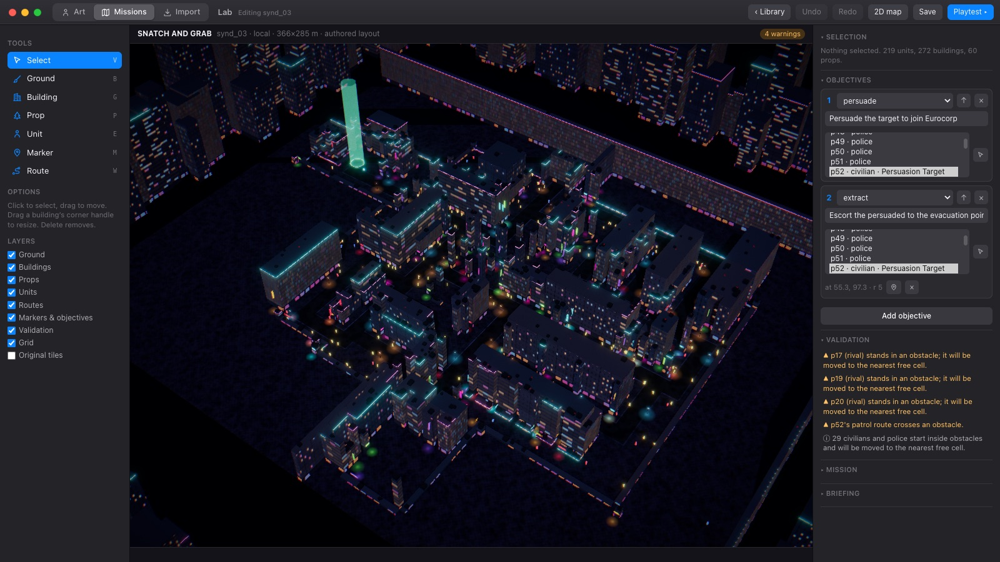 |

### Import: original Syndicate missions

The Import tool is the Lab's front end to the converter described [below](#playing-the-original-syndicate-missions):

- **Load the data:** read your copy from `content-local/` through the dev server, choose the folder, or drop it on the page. The files are cached in the browser's IndexedDB and never leave your machine.
- **Browse:** every mission in both campaigns, with its map, head count and objective types.
- **Compare:** the original map and the converted result side by side. Hover a tile to inspect its whole column of tiles and anyone standing on it. Click a tile to reclassify it, which applies everywhere that tile appears.
- **Tune:** all the conversion settings are live, with the result updating as you change them.
- **Convert:** **Convert to draft** saves `content-local/missions/<id>.json` and opens it in the editor. Converting again offers to update only the map, keeping your edits to units, objectives and briefing. **Convert all** does a whole campaign.

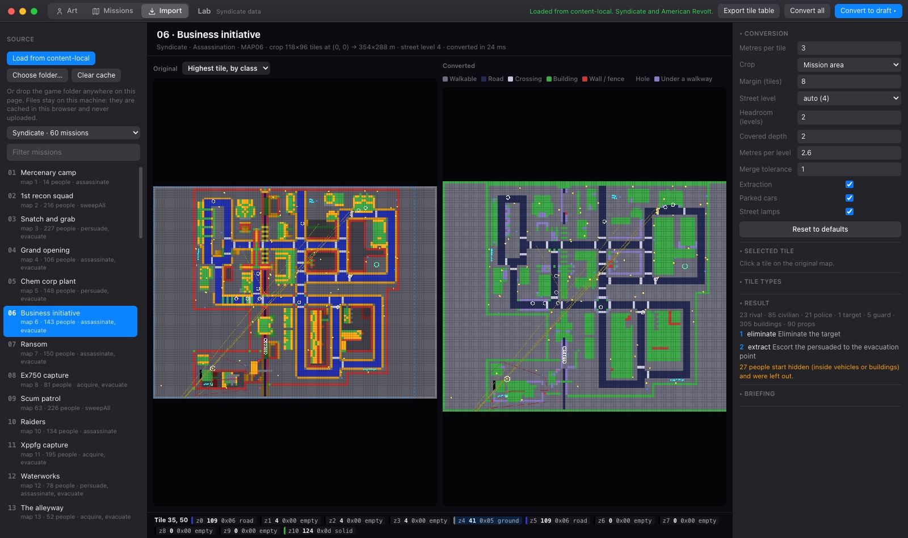

The screen has three columns:

- **Left:** the data source, the campaign (*Syndicate* or *American Revolt*), and the mission list. Each row gives the mission number, title, map number, how many people start on the map, and the original objective types. Missions `90`–`99` are the multiplayer maps.
- **Middle:** the original map beside the converted one.
  - **Original map:** people are coloured by class (cyan agents, yellow civilians, blue police, red guards, magenta criminals). Patrol routes are drawn as lines, and objective targets are ringed. The dashed blue box is the crop. The map can show the highest tile in each column by class, only the street level, or raw tile ids.
  - **Converted map:** each tile is coloured by what it became; a legend explains the colours.
  - **Tile inspector:** the bar underneath lists the whole column under the cursor, one entry per level: tile id, COL01 type and class, with the street level highlighted. It also lists anyone standing there, with their weapons.
- **Right:** the settings, the tile tables and the result.

| Setting | Default | What it does |
| --- | --- | --- |
| Metres per tile | 3 | Size of a Syndicate tile in the converted map |
| Crop | Mission area | Trim to where people and cars are, or keep the whole 128 × 96 map |
| Margin | 8 tiles | Extra map kept around the mission area |
| Street level | auto | The layer most people stand on; set a number to read every column at that level |
| Headroom | 2 levels | Free space above a floor for it to count as walkable |
| Covered depth | 2 tiles | How far covered ground stays walkable from open ground (bridges vs. building interiors) |
| Metres per level | 2.6 | Turns tile stacks into building heights |
| Merge tolerance | 1 level | How different in height neighbouring columns can be and still merge into one building |
| Extraction, parked cars, street lamps | on | Add a VTOL objective, keep the original cars as parked props, add kerb lamps |

- **Selected tile:** click any tile on the original map to see its id, COL01 type and class. Changing its class overrides that tile id on every map.
- **Tile types:** sets the default class for each COL01 type.
- **Saving tables:** the tables and settings are saved in the browser. **Export tile table** downloads your overrides as JSON, ready to fold back into `src/import/syndicate/tileClasses.ts`.
- **Result:** unit counts, the converted objectives with any TODOs, notes such as how many people started hidden inside vehicles, and the full briefing text.

### Art: style boards

The Art tool is where the art direction gets settled before any assets go into the game. It uses the game's own renderer: the same post-processing, environment lighting and facade shader.

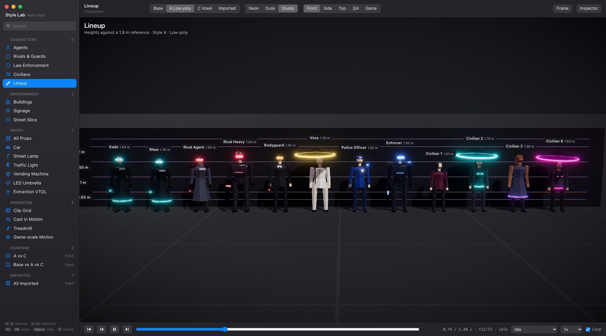
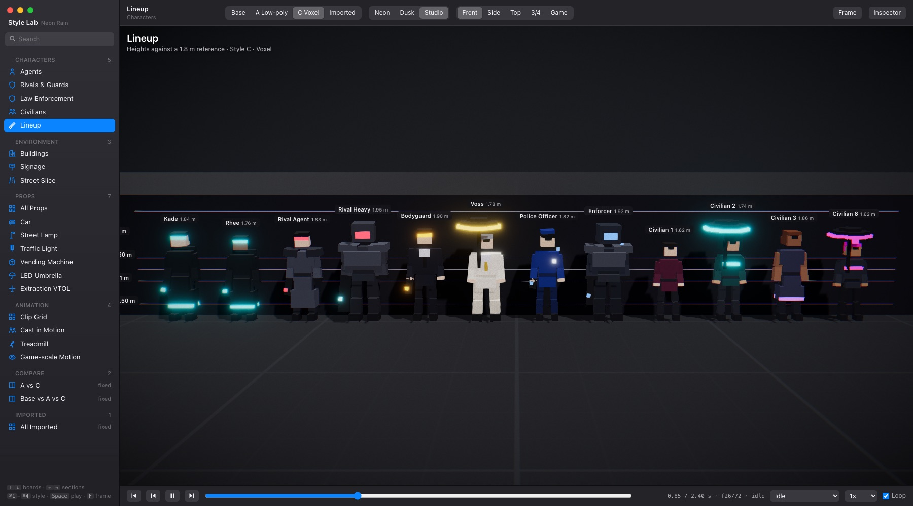

- **Styles:** *Base* is today's in-game primitives. *A · Low-poly* is flat-shaded, faceted shapes. *C · Voxel* is chunky, about 26 voxels tall, with stepped 8 fps motion. *Imported* shows GLB and `.vox` files. Every style renders the same character designs (`src/lab/kits/designs.ts`), so a comparison never changes who is who.
- **Boards** are grouped in a macOS-style source list: character groups, a lineup against a 1.8 m ruler, buildings, signage, a street slice, props, animation boards, and style comparisons. Search, collapse, and `↑`/`↓` navigate; every view is a deep link. `⌥1` to `⌥4` switch style.
- **Viewport:** drag to orbit, right-drag to pan, scroll to zoom; *Front, Side, Top, 3/4* and *Game* (the in-game camera) presets. Click selects, double-click or `F` frames.
- **Animation:** every character runs on a shared Mixamo-named skeleton with 17 placeholder clips, one per game state (idle, walk, run, aim-walk, strafe, shooting, throw, persuade, hit, two deaths, panic, cower, umbrella walk, persuaded shuffle). The timeline plays, pauses, scrubs, steps frames and changes speed, and the inspector has a crossfade tester. The *Clip Grid*, *Treadmill* (in-game speeds, foot contact markers, root trail) and *Game-scale Motion* (in-game camera at true pixel density) boards are for judging motion.
- **Review tools:** silhouette mode, pixel preview, turntable, rain and wet floor, skeleton overlay, onion skin, and PNG export.

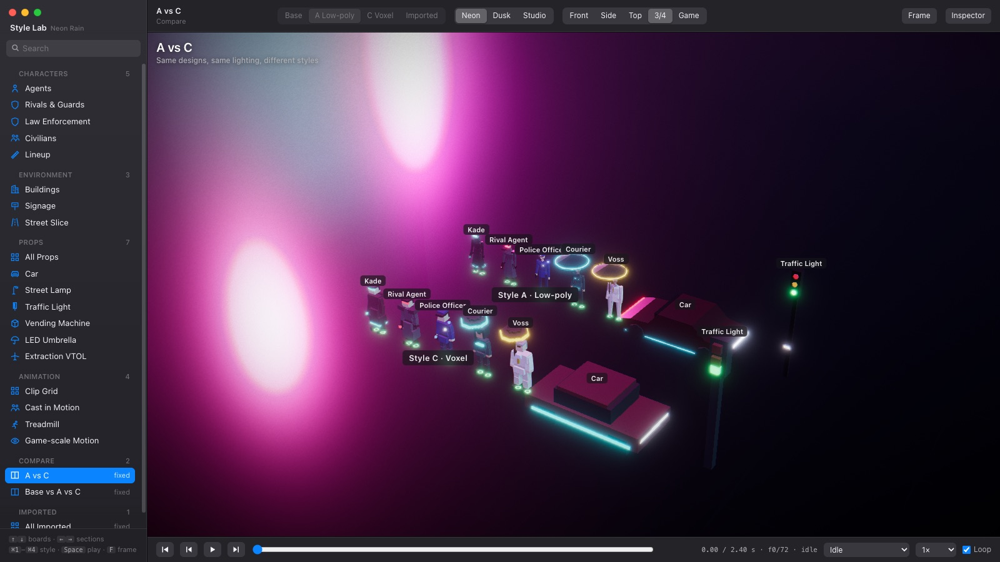

#### Bringing in real models

Put files in `public/lab/assets/` and list them in `public/lab/manifest.json`. You can also drop `.glb`, `.gltf` or `.vox` files straight onto the viewport:

```json
{ "id": "agent-tripo-01", "name": "Agent (Tripo)", "file": "assets/tripo/agent_01.glb",
  "category": "character", "kind": "agent", "height": 1.84, "source": "Tripo image-to-3D",
  "clipAliases": { "Armature|Rifle Run": "run" } }
```

Models are scaled to `height` and placed on the floor. Clips are mapped onto the catalogue by name: Mixamo names are recognised, and `clipAliases` covers the rest. The inspector lists missing clips. The conventions: +Y up, the character faces +Z, metres, and a Mixamo skeleton (`mixamorig:*`) so every character shares one set of clips.

#### Ready-made models

`public/lab/assets/generated/` holds models baked from the lab's kits. They load back in through the imported-GLB path; each one has a board under **Imported** in the lab.

- Five characters in both styles: agents Kade and Mara, a rival agent, a police officer, and a courier. Each is a single skinned mesh on a Mixamo-named skeleton with all 17 clips, and opens in Blender for touch-ups.
- `.vox` sources for the Style C characters, which open in MagicaVoxel.
- A car and the extraction VTOL in both styles.

To regenerate them after changing a kit, run `await lab.exportModels()` in the lab's dev console. `await lab.captureRefs('agent:0')` renders front, left, back and right reference images to `public/lab/assets/refs/`.

#### Tripo

`tools/art/tripo.ts` runs the Tripo 3D API. It generates from a text prompt, the front reference image, or all four reference views; applies Tripo's voxel stylise for Style C; rigs to a Mixamo skeleton; and retargets the preset animations. Results go to `public/lab/assets/tripo/` and are registered in the manifest. The API key is read from `.env.local` (`TRIPO_API_KEY=...`).

```sh
npm run art:tripo -- balance
npm run art:tripo -- presets
npm run art:tripo -- make agent --from multiview --rig              # Style A
npm run art:tripo -- make agent --style voxel --from multiview --rig
npm run art:tripo -- make police --from text --dry-run              # print payloads only
```

Finished stages are logged, so a run that is interrupted, or that stops when credits run out, picks up where it left off.

## Playing the original Syndicate missions

The game can load the 1993 campaign (and the American Revolt data disk) from your own copy of Syndicate and play it in Neon Rain's engine. The same code also serves as a reference point for designing new missions.

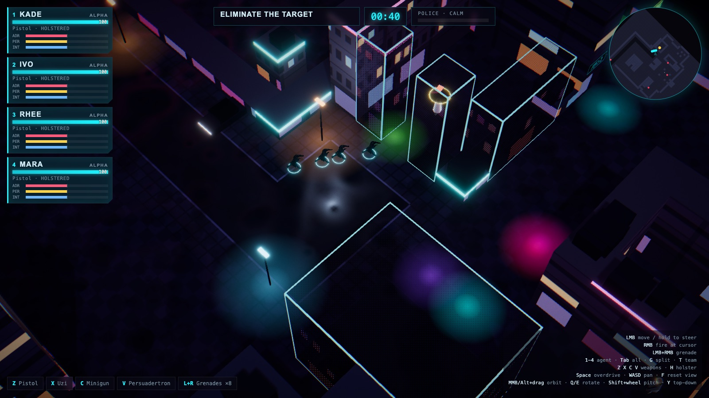

| | |
| --- | --- |
| 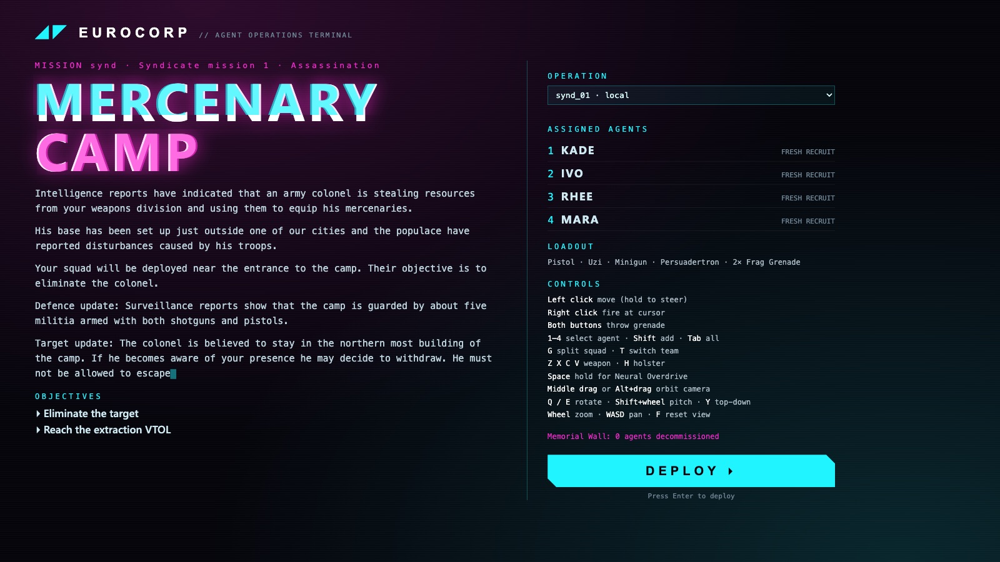 |  |

**Bring your own copy.** Syndicate belongs to Electronic Arts, so none of its data is in this repository, and none can be added:

- The original files go in `content-local/`, which is gitignored.
- Converted missions are saved to `content-local/missions/`, also gitignored.
- The dev server only reads these folders locally, and production builds never include them.
- Only **Promote** a mission into `src/content/missions/` once it has been reworked into your own design.

### Using it

1. Copy the game folder as it is into `content-local/`. The Syndicate Plus release works as it comes: it has `SYNDICAT/DATA` for the original campaign and `DATADISK/DATA` for American Revolt. Any folder that holds `COL01.DAT` plus `GAMExx.DAT` and `MAPxx.DAT` files is recognised, however deep it sits.
2. Convert missions, using either route:
   - **Lab:** open *Lab → Import* and press *Load from content-local*, pick a mission, adjust the settings, then press *Convert to draft*.
   - **Terminal:** run `npm run synd:convert -- --all`. Add `--set revolt` for the data disk, `--mission 7` for a single mission, or `--scale 4` for a larger map.
3. Play: pick the mission in the briefing screen's operation picker, open `/?mission=synd_07`, or press *Playtest* in the editor.

`npm run synd -- list` prints every mission found. `npm run synd -- dump --mission 3` writes PNGs of the original map, its street level and the converted result to `.synd-import/` (gitignored), with a JSON listing of everything parsed from the mission.

### The data files

Everything below was checked against the real files, and every parser lives in `src/import/syndicate/`. [FreeSynd](https://freesynd.sourceforge.io/)'s documentation was used as a map of the formats; the code here is our own.

| File | What it holds |
| --- | --- |
| `GAMExx.DAT` | One mission: people, cars, objects, weapons, waypoints, objectives, and which map to use. `01`–`50` are the campaign, `90`–`99` the multiplayer maps. |
| `MAPxx.DAT` | A city as 3D tile stacks. |
| `COL01.DAT` | The type of each of the 256 tile ids. |
| `MISSxx.DAT` | Briefing text. `MISS01`–`50` are English; `MISS101`–`450` are the French, German, Italian and Spanish versions. |
| `HBLK01.DAT` | The isometric tile graphics. Not used, because we draw the city our own way. |

**RNC ProPack compression.** Every binary file above is packed with RNC ProPack method 1 (`rnc.ts`):

- **Header (18 bytes, big-endian):** `RNC\x01`, the unpacked and packed sizes as u32, two CRC16s, a leeway byte and a chunk count.
- **Bit stream:** read least significant bit first, from 16-bit little-endian words.
- **Chunks:** each chunk starts with three small Huffman tables (literal-run lengths, match distances and match lengths), each up to 31 codes with 4-bit code lengths, followed by a sequence count. Each step copies a run of raw literal bytes straight from the input, then an LZ77 match of `distance + 1` back and `length + 2` long.

Files without the `RNC` signature (the briefings) are used as they are.

**`MAPxx.DAT` (`mapFile.ts`).** Three little-endian u32s (width, height, levels) come first, always 128 × 96 × 12. Then comes one u32 per map cell: an offset (from byte 12) to that cell's column of 12 tile ids, bottom level first. Identical columns are stored once, which is why a map unpacks to only 50–80 KB. Most cities have their street at level 1. A few are built on decks, or have more than one street layer: Business initiative runs an elevated road network at level 5 over a lower road at level 0.

**`COL01.DAT` (`tileClasses.ts`).** 256 bytes, one type per tile id. The names below come from rendering every map by type and looking at where each one appears:

| Type | Looks like | Type | Looks like |
| --- | --- | --- | --- |
| `0x00` | Empty | `0x0A` | Wall |
| `0x01`–`0x04` | Slopes (four directions) | `0x0B` | Road junction |
| `0x05` | Ground (pavement, floors, rooftops) | `0x0C` | Fence |
| `0x06`–`0x09` | Road lanes (one per direction of travel) | `0x0D` | Solid block (buildings) |
| `0x0E` | Pedestrian crossing | `0x0F` | Road marking |

**`GAMExx.DAT` (`gameFile.ts`).** 116,010 bytes of fixed tables:

| Offset | Records | What we read |
| --- | --- | --- |
| `0x8008` | 256 people × 92 bytes | `+4/+6/+8` x, y, z; `+10` state (`4` = on the map, `0x0D` = hidden, for example inside a car); `+20` health; `+26` facing; `+28` class (`1` civilian, `2` agent, `4` police, `8` guard, `16` criminal); `+40` first waypoint |
| `0xDC08` | 64 cars × 42 bytes | Position, model, facing |
| `0xE688` | 400 objects × 30 bytes | Position and kind (not used yet) |
| `0x11568` | 512 weapons × 36 bytes | Position; `+25` kind (`1` Persuadertron, `2` pistol, `3` Gauss gun, `4` shotgun, `5` Uzi, `6` minigun, `7` laser, `8` flamer, `9` long range, …); `+32` owner |
| `0x17B68` | 2048 waypoints × 8 bytes | `+0` next (a byte offset into this table), `+4/+5/+6` x, y (in half tiles) and z, `+7` type (`9` loops back to the start) |
| `0x1BD28` | Map info | `+0` map number |
| `0x1BD36` | 6 objectives × 14 bytes | `+0` type (`1` persuade, `2` assassinate, `3` protect, `5` acquire, `10`/`11` wipe out the police or everyone, `14` destroy a vehicle, `15` use a vehicle, `16` evacuate), `+2` the record it's about, `+4` a position |

- **Units:** positions are u16s, 256 units per tile across and 128 units per level up.
- **References:** a reference between records (an objective's target, a weapon's owner) is the record's file offset minus `0x8006`.
- **The squad:** the player's squad is people 0–3. People 4–7 are unused slots, and any other people of the agent class are rival syndicate agents.

**`MISSxx.DAT` (`missFile.ts`).** Plain text, split into blocks by lines holding a single `|`:

1. The first two blocks are the prices of the extra intelligence you could buy.
2. The third block is the free briefing: a title, the mission type, then the text.
3. Every block after that is one of the purchasable intelligence updates.

### How a mission is converted

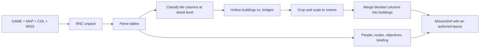

Syndicate cities are stacks of isometric tiles, while our sim is a flat 2D grid, so `convert.ts` reads each tile column and decides what it means at street level. Every threshold below is a setting in the Import tool.

1. **Surfaces.** A surface is a floor tile (ground, road, crossing, slope, or the top of a solid block) with **headroom** above it: two empty levels. For each column, the converter takes the surface closest to the layer most of the mission's people stand on (the *street level*, normally 1). The tile at that surface decides the ground: road, crossing or walkable ground. A column with no surface is a wall or fence, a solid building, or a hole (water, a pit). A fixed street level can be set instead, which reads every column at that one level.
2. **Flood from the people.** Walkable ground is whatever can be reached from where the mission's people stand. Neighbouring columns join at the same height, or one level apart where a slope, or a road slab next to its pavement deck, makes the step. Unreached surfaces that are raised or covered, such as rooftops and closed interiors, become buildings. Unreached open ground at street height, like the land outside a city wall, stays ground. The highest tile in a column gives a building its height.
3. **Covered ground.** A walkable column with a structure overhead is either the street under a bridge or walkway, or the inside of a building. Syndicate buildings are hollow shells, with walls round the edge and a roof on top. So covered ground stays walkable only within **covered depth** (2 tiles) of open ground, and anything deeper becomes part of the building. One exception: rooms containing a guard or an objective target stay walkable, so the colonel in mission 1 is still in his hut.
4. **Crop and scale.** The map is cropped to where the mission's people and cars are, plus a **margin** (8 tiles), then scaled to **3 m per tile**. Walkable tiles next to a road become sidewalk; the rest become plaza.
5. **Buildings.** Blocked columns are merged greedily into rectangles of similar height (**merge tolerance**, 1 level), at **2.6 m per level**. Fences and walls become 1.4 m high blocks.
6. **Props.** Cars become parked cars, lined up with the road lane they're on. Street lamps are added along kerbs, as in the procedural city.
7. **People** who are on the map become explicit spawns with ids like `p12`. Their waypoint chains become patrol routes (a guard with no route holds its post), and their weapons are mapped to ours.

   | Syndicate | Neon Rain |
   | --- | --- |
   | Civilian, police | `civilian`, `police` |
   | Guard | `guard` (`heavy` if carrying a minigun or Gauss gun) |
   | Criminal, rival agent | `rival` |
   | Assassination target | `target` |
   | Protected VIP (whatever their class) | `civilian` that walks the original route |
   | Pistol / Uzi / shotgun, flamer / Gauss gun, laser / minigun | `enemyPistol` / `enemyUzi` / `riotGun` / `enemyGauss` / `minigun` |

8. **Objectives** map onto ours:

   | Syndicate | Neon Rain |
   | --- | --- |
   | Assassinate | `eliminate` (fails if the target reaches the escape point) |
   | Persuade | `persuade` |
   | Protect | `protect`: the VIP walks their original route, and the objective completes when they reach the end of it |
   | Evacuate | `extract` with the persuaded people as escorts |
   | Wipe out the police / everyone | `sweep` |
   | Acquire, destroy or use a vehicle | `reach` a point, with a TODO note on the objective |

   An extraction at a VTOL near the drop point is appended, because Neon Rain missions end by getting out.
9. **Briefing.** The free text and all the purchasable updates become the briefing. The title becomes the codename.

Every one of the 100 converted missions loads and runs deterministically in `sim:smoke`, at under 1 ms per sim tick even for the largest maps.

**What's lost for now:**
- Second street layers, raised walkways and upper floors: the flattening keeps one layer, so a city with two (such as Business initiative) loses the one fewer people stand on.
- Traffic: authored maps have no grid roads for cars to drive on.
- Vehicle objectives: approximated as reaching a point.
- People who start inside vehicles.
- The original tile art: imported maps use Neon Rain's buildings.

The Lab's *Original tiles* layer shows the source classification underneath the converted map, which helps when hand-fixing a conversion.

## Dev tooling

- `node scripts/sim-smoke.ts [ids…] [--full]` plays every bundled mission and every mission in `content-local/missions/` headless with a scripted squad that heads for the current objective. It checks that two runs with the same inputs produce identical state. Neon Rain always runs the full 150 s and has to show real combat.
- `node scripts/lab-e2e.ts [--url http://localhost:5173]` drives the Lab in headless Chrome, with the dev server running. It paints, builds, places units, draws a route, edits objectives, undoes and redoes, saves, toggles the 3D preview, switches tools, then loads Syndicate data in the Import tool, reclassifies a tile and converts a mission.
- `npm run synd -- list | dump | convert` is the Syndicate data CLI (see above). `node tools/syndicate/unpack.ts <DATA dir>` writes RNC-unpacked copies of every file to `.synd-import/raw/` for poking at with a hex editor.
- `node scripts/traffic-check.ts` runs 3 minutes of city life with no player input. It fails if any car leaves the road, or if more than a couple of calm (non-panicked) pedestrians are hit.
- `node scripts/diag.ts [--drawn]` is a balance probe: it walks the squad toward the plaza and logs how the fight unfolds.
- `node scripts/shot.ts --url ... --wait ... --eval ... --shot delay:path.png` drives a headless Chromium over the DevTools protocol to capture screenshots and run scripted scenes. With the dev server running, `window.game.advance(ticks, commands)` fast-forwards the sim.

## Roadmap

- Tune feel and difficulty from playtesting.
- Syndicate's world map: territories, tax rates, and unrest.
- Research and cyborg modifications between missions.
- More missions and city districts, designed in the Lab.
- Better Syndicate imports: raised walkways as a second walkable level, vehicle objectives, and traffic on authored road networks.
- Occasional stealth missions in the style of Commandos and Desperados: vision cones, takedowns, bodies, cameras and cyborg tools. See the [design doc](docs/design/stealth-missions.md).
- Online co-op, with the sim running on an authoritative Node server.
- Port to Godot or Unity for native rendering and DLSS/FSR. A Godot project scaffold is already in the repo root.

## Disclaimer

A non-commercial fan project. Not affiliated with or endorsed by Electronic Arts, Bullfrog Productions, or Sensible Software. Syndicate and Cannon Fodder are trademarks of their respective owners.
